En el presente informe se lleva a cabo el análisis de un conjunto de datos cuya temática principal consiste en la extracción en pozos petrolíferos y el tipo de roca encontrada en cada capa de la tierra. Durante el desarrollo del mismo se hará referencia al código, presente en el fichero "código.R".

Podemos encontrar el dataset en la siguiente fuente: http://chasm.kgs.ku.edu/ords/qualified.well_page.DisplayWell?f_kid=1044871715

La estructura del presente documento es la siguiente:

  1. Descripción del problema.
  2. Descripción de los datos.
  3. Preparación de los datos.
  4. Modelado.
  5. Evaluación.
  6. Conclusiones.
      
## 1. Descripción del problema

El objetivo principal de los registros de pozos que se realizan en la industria petrolera es, determinar si una formación contiene hidrocarburos, así como también las características litológicas de la formación que los contiene. Con anterioridad a la invención de los registros geofísicos de pozos, prácticamente la única manera de conocer las propiedades fundamentales de las rocas era mediante la inspección y el análisis directo de las rocas extraídas de los sondeos y pruebas de formación.

Con estos datos de determina la litología (en lo que se centra este trabajo), resistividad real, densidad volumétrica, geometría, porosidad y la permeabilidad.

## 2. Descripción de los datos

Los datos se corresponden a los resultados obtenidos de la realización de diversas
pruebas de sondeo en el suelo. Estas pruebas generan unas reacciones en los materiales
que son las presenta el dataset.

El dataset presenta un total de 21 variables, de las cuales todas excepto la variable respuesta
(categórica), son numéricas. Hay un total de 9460 mediciones comprendidas entre los 0 y los 4720
pies de profundidad, con un intervalo de 0,5 entre cada muestra entre los 3500 pies hastsa el final del pozo.

La variable respuesta es el tipo de material encontrado. Ésta se divide en:

|     Lito                             | Cantidad
|-------------------------------------- | --------------------------------------
| Anhidrita                             |  66
| Arcillas ricas en materia orgánica    |  10  
| Calcarenitas                          |  156 
| Calcarias                             |  654 
| Arenas                                |  38 
| Arcillas                              |  1566 

A continuación se presentan los histogramas de las variables:

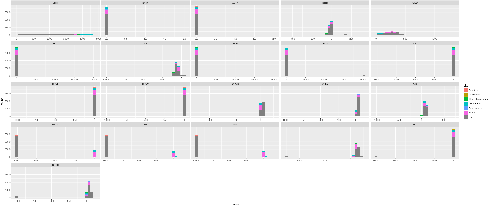{ width='95%'}

## 3. Preparación de los datos

El conjunto de datos actual presenta ciertas características que han de ser tratadas antes del análisis. A continuación se detallarán los pasos que se han seguido para seguidos para la limpieza de los datos.

#### Limpieza de datos

  * Filtrado de NAs en la variable salida: la variable resultado presenta valores que son NAs. En estas muestras a priori no nos valen para incluirlas en el modelo, ya que no nos dan información. Podríamos introducir un método de predicción para estos casos, pero en principio decidimos eliminar dichos casos. Tras eliminar los NAs en la variable de salida:
  
 * Valores sin sentido convertidos a NAs: en algunas de las variables encontramos valores numéricos que, según nuestro experto en el dominio, no tienen sentido (por ejemplo, -999.25). Por ello, estos valores serán reconvertidos en NAs.
  
  * Agrupación de la variable resultado: dentro de la variable resultado, tenemos dos valores concretos con muy pocas muestras y que no son representativas para nuestro problema. Además, por su semejanza en el material con otros valores de la variable respuesta, las muestras *Carb Shale* y *Sandstones* en el mismo grupo que los *Shale*.
  
  * Eliminación de variables: la variable 'depth' puede ser considerada como un "id", concretamente una localización geográfica que no que en este sondeo nos  podría indicar con una seguridad bastante alta, el material al que nos estamos refiriendo pero no nos serviria en ningún otro. Para que tenga mayor sentido el análisis de los datos y sea más generalizable, eliminaremos esta variable.
  
#### Normalización de variables

Algunas variables se centran alrededor de un valor. Se les aplicará un logaritmo para intentar separarlas y poder extraer mas información de ellas. Concretamente: RLL3, RILD, RILM, DCAL, MCAL, MI, MN y RHOC.
  
#### Estimación de datos faltantes

Como se ha mencionado con anterioridad, tenemos datos faltantes en algunas de las muestras. Como no es un gran número
de muestras (sin contar la variable respuesta) las que presentan NAs, procederemos a la imputación de dichos valores.
Para ello, primero veremos las correlaciones entre las variables, aplicaremos los métodos de imputación y volveremos
a ver las correlaciones para comprobar que no ha habido cambios en las relaciones entre variables.

Para la primera estimación se ha usado la función *knnImputation*, con el parámetro 'mediana' para la estimación de valores y
con un factor knn de 4 vecinos, que se tendrán en cuenta para la decisión de la imputación de valores.

Se ha realizado una segunda imputación sobre el mismo dataset, mediante el método de imputación múltiple con la finalidad de comparar resultados.

#### Diferencia antes y después de las estimaciones de datos faltantes

Imputación KNN

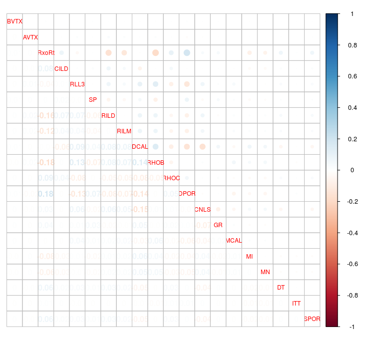{ width='40%' }

Imputación MICE

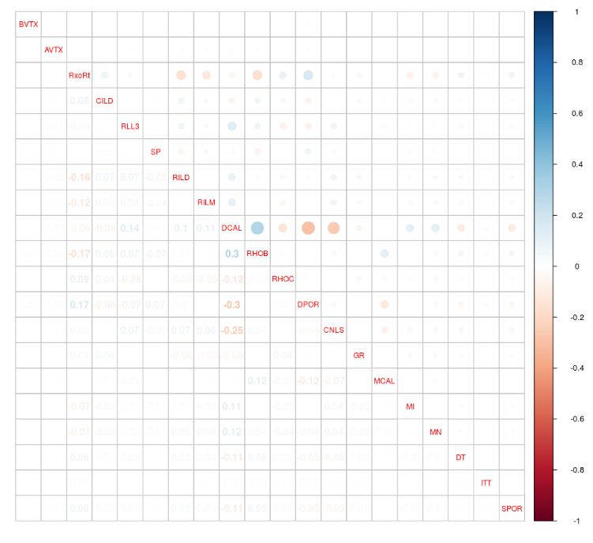{ width='40%' }

Una prueba de que los datos no se han visto alterados en exceso ni las relaciones entre ellos, es la resta de ambas tablas de correlación. La figura anterior representa
esta operación. Como podemos ver la mayoría de los valores, para ambos tipos de imputación, están cercanos al 0. Esto nos indica que las estimaciones de NAs han servido para rellenar los valores
faltantes sin alterar la naturaleza de los datos.

Sin embargo, podemos observar como los valores por imputación knn son menores que para MICE, por lo que nos quedaremos con la imputación por knn

#### Visualización histogramas despúes de la preparación de los datos

A continuación se visualizan los histogramas con todas las operaciones de limpieza y preparación de datos realizados.

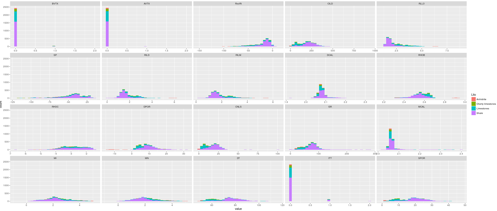{ width='75%'} 

#### Train y Test

De cara a ver la performance de los modelos, tenemos que entrenarlos con un conjunto de datos y evaluarlo con otro. Para ello, dividimos el conjunto de datos principal en dos datasets diferentes, uno de training compuesto por el 70% de las muestras, y otro de test, compuesto por el 30% restante.

## 4. Modelado

#### Regresión logística

La regresión logística es un modelo binario, es decir, sirve para separar dos clases. Como nuestro conjunto de datos es multiclase vamos a centrarnos en identificar las limestones del resto de rocas, ya que según nuestro experto, este tipo de rocas son en las que debemos centrarnos para encontrar hidrocarburos. Para ello agruparemos las limestones y cherty limestones en una clase llamada Limestones y las shale y anhidrite en Others.

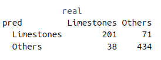{ width='30%' }

Medidas de evaluación:

  * Accuracy:  0.8534946

     Lito  | Precision | Recall
-----------|-----------|-----------
Limestones |0.7389706           |0.8410042
    Others |0.9194915           |0.8594059
            
  
Los resultados obtenidos, si realizamos la predicción sin tener en cuenta los subtipos de roca (mismo criterio que train), obtienen muy buenos resultados para diferenciar limestones de otro tipo de rocas. A continuación crearemos modelos multiclase y que permitan la clasificación en los distintos tipos de roca.

#### Knn

Además de la imputación por knn, se ha llevado a cabo un modelo de knn. A continuación se muestra el rendimiento del modelo de acuerdo a las medidas anteriormente descritas.

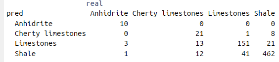{ width='40%' }

  * Accuracy: 0.8655914
  
       Lito           | Precision | Recall
----------------------|-----------|-----------
Anhidrite             | 1.0000000 | 0.7142857
Cherty limestones     | 0.7000000 | 0.4565217
Limestones            | 0.8031915 | 0.7823834
Shale                 | 0.8953488 | 0.9409369
    
Se puede observar en la matriz de confusión del modelo k-nn que el resultado es bastante mejor que el obtenido con la regresión logística, aunque las cherty limestones siguen causándonos problemas, ya que solo recuperamos un 45% de las muestras.

#### Arbol decisión

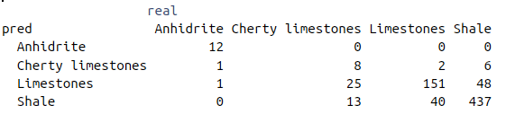{ width='60%' }

Como se puede observar en la matriz de confusión, el árbol de decisión se comporta peor en nuestro conjunto de datos que el modelo k-nn, especialmente con las cherty limestones.

  * Accuracy: 0.8172043

       Lito           | Precision | Recall
----------------------|-----------|-----------
Anhidrite             | 1.0000000 | 0.8571429
Cherty limestones     | 0.4705882 | 0.1739130
Limestones            | 0.6711111 | 0.7823834
Shale                 | 0.8918367 | 0.8900204
            
#### Random Forest

Para este tipo de modelado, se van a llevar a cabo dos implementaciones. Una a partir de una librería predefinida en r y una segunda implementación basada en el código visto en clase.

Utilizando la implementación propia vista en clase de randomForest, se puede observar que la recuperación es similar a la obtenida con el árbol de decisión. Las cherty limestones siguen siendo un problema a la hora de realizar la clasificación.

A continuación podemos ver que usando la implementación vista en clasea del Random Forest (Custom), la clasificación mejora, en gran parte debido a la clasificación correcta de las cherty limestones.

  * Accuracy: 0.8252688

       Lito           | Precision | Recall
----------------------|-----------|-----------
Anhidrite             | 1.0000000 | 0.85714286
Cherty limestones     | 1.0000000 | 0.06521739
Limestones            | 0.6787330 | 0.77720207
Shale                 | 0.8838583 | 0.91446029

Siguiendo el modelo Random Forest de r, obtenemos los siguientes resultados:

  * Accuracy: 0.8857527

       Lito           | Precision | Recall
----------------------|-----------|-----------
Anhidrite             | 1.0000000 | 0.8571429
Cherty limestones     | 0.9473684 | 0.3913043
Limestones            | 0.7941176 | 0.8393782
Shale                 | 0.9174853 | 0.9511202

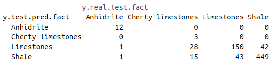{ width='60%' }

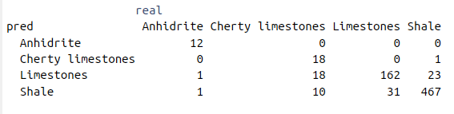{ width='60%' }

#### Bagging

Esta técnica de modelado consiste en la iteración sobre un modelo con la finalidad de obtener mejores resultados con la concatenación de predicciones. A partir de la librería adaboost, obtendremos las métricas para este tipo de modelado y para el boosting.

A continuación se muestran medidas tanto para train (primeros resultados) como para el conjunto de test.

  * Accuracy: 0.8605991

       Lito           | Precision | Recall
----------------------|-----------|-----------
Anhidrite             | 1.0000000 | 0.9302326
Cherty limestones     | 0.9259259 | 0.2336449
Limestones            | 0.7655602 | 0.7918455
Shale                 | 0.8930076 | 0.9464286    
        
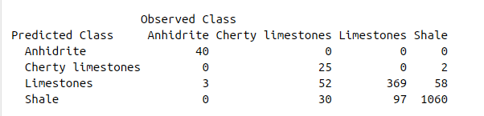{ width='60%' }

  * Accuracy: 0.827957
       
       Lito           | Precision | Recall
----------------------|-----------|-----------
Anhidrite             | 1.0000000 | 1.0000000
Cherty limestones     | 0.6153846 | 0.1632653
Limestones            | 0.7074468 | 0.7074468
Shale                 | 0.8692308 | 0.9338843

{ width='60%' }

#### Boosting

Como se ha comentado con anterioridad, usamos la librería adaboost para llevar a cabo este modelado.

Las medidas que obtenemos evaluando el modelo con el conjunto de train son las siguientes:

  * Accuracy: 0.8974654
       
       Lito           | Precision | Recall
----------------------|-----------|-----------
Anhidrite             | 1.0000000 | 0.9302326
Cherty limestones     | 0.8965517 | 0.4859813
Limestones            | 0.8189300 | 0.8540773
Shale                 | 0.9270833 | 0.9535714

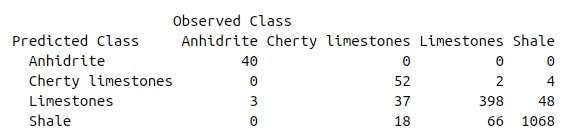{ width='60%' }

Por otro lado, evaluando el modelo con el conjunto de test obtenemos:

  * Accuracy: 0.8508065
       
       Lito           | Precision | Recall
----------------------|-----------|-----------
Anhidrite             | 1.0000000 | 1.0000000
Cherty limestones     | 0.7647059 | 0.2653061
Limestones            | 0.7382199 | 0.7500000
Shale                 | 0.8888889 | 0.9421488

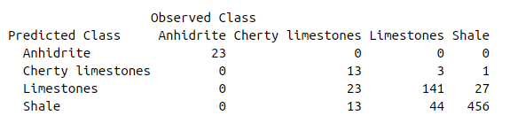{ width='60%' }

En la librería utilizada, se proporciona un método que da como resultado la importancia de las variables en el modelo, en relación a la variable objetivo.

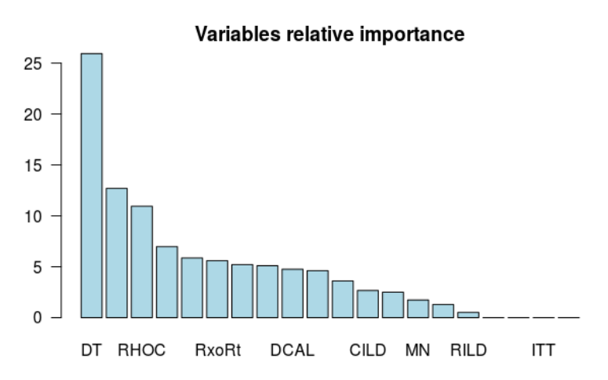{ width='60%' }

#### SVM

En este apartado se lleva a cabo un modelado por máquinas de vector soporte. Dicha implentación se ha utilizado la librería e1071.

Métricas de evaluación con el conjunto de entrenamiento.
     
  * Accuracy: 0.9971198157
       
       Lito           | Precision | Recall
----------------------|-----------|-----------
Anhidrite             | 1.0000000 | 1.0000000
Cherty limestones     | 1.0000000000 | 0.9818181818
Limestones            | 0.9935064935 | 0.9956616052
Shale                 | 0.9982046679 | 0.9991015274

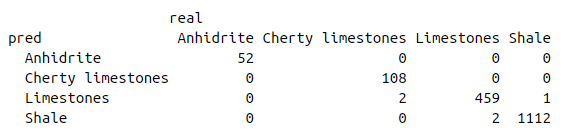{ width='60%' }

Métricas de evaluación con el conjunto de test.

  * Accuracy: 0.9059139785
       
       Lito           | Precision | Recall
----------------------|-----------|-----------
Anhidrite             | 1.0000000 | 0.7857142857
Cherty limestones     | 0.8333333333 | 0.5434782609
Limestones            | 0.8615384615 | 0.8704663212
Shale                 | 0.9251968504 | 0.9572301426

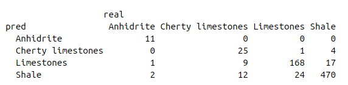{ width='60%' }

Como podemos observar, hasta el momento el modelado con SVM ha generado la mejor predicción tanto en train como en test.

#### Neuronal network

Para la implementación de una red neuronal, se ha escogido la librería neuralnet. Para poder obtener unos resultados óptimos, se han tenido que realizar algunas transformaciones. La primera ha sido la normalización de todaas las variables entre 0 y 1. Recordemos que todo el dataset, salvo la variable objetivo, son numéricas, por lo que no ha generado una gran dificultad. Por otro lado, se ha decidido cambiar la categoría "Cherty limestones" por "Cherty".

Como parámetros principales, se han acordado tener dos capas escondidas con 3 y 2 neuronas respectivamente. La ejecución del modelo ha dado el siguiente log de registro de ejecución:

hidden: 3, 2    thresh: 0.1    rep: 1/5    steps:   25401	error: 200.57056	time: 27.25 secs
hidden: 3, 2    thresh: 0.1    rep: 2/5    steps:    7839	error: 214.19877	time: 8.43 secs
hidden: 3, 2    thresh: 0.1    rep: 3/5    steps:   13422	error: 197.35598	time: 14.2 secs
hidden: 3, 2    thresh: 0.1    rep: 4/5    steps:    5796	error: 241.97558	time: 6.35 secs
hidden: 3, 2    thresh: 0.1    rep: 5/5    steps:   36618	error: 206.00299	time: 39.48 secs

Finalmente, con esta implementación, se ha obtenido una accuracy de 0.8293010753

A continuación se puede observar la red neuronal generada.

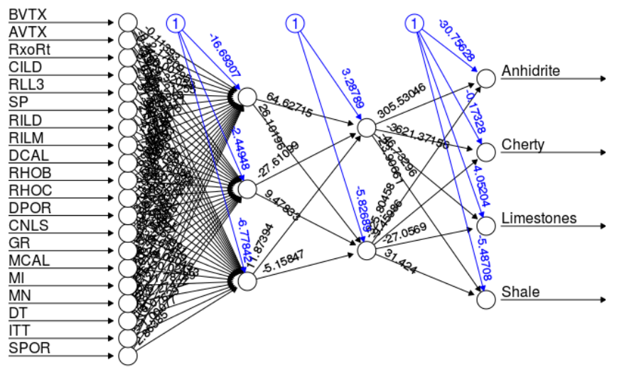{ width='60%' }

## 5. Evaluación

En la siguiente tabla se pueden observar las mediciones de "Accuracy"

 Ranking  |        Método        | Tipo Clasificación | Accuracy
----------|----------------------|--------------------|-------------
    1     | SVM                  | Multiclase         | 0.90
    2     | Random Forest        | Multiclase         | 0.88
    3     | Knn                  | Multiclase         | 0.86
    4     | Bagging              | Multiclase         | 0.85
    5     | Logistic Regression  | Binaria            | 0.85
    6     | Neuronal Network     | Multiclase         | 0.83
    7     | Boosting             | Multiclase         | 0.83
    8     | RandomForest"Custom" | Multiclase         | 0.83
    9     | Decision Tree        | Multiclase         | 0.81
    
    
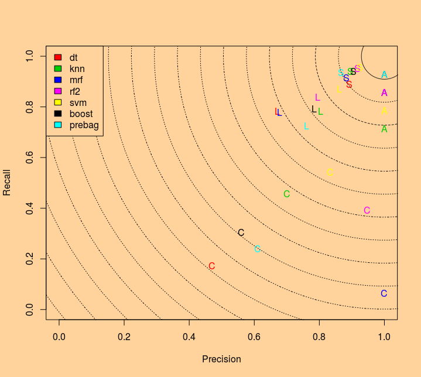{ width='60%' }
    
En el gráfico anterior podemos observar, para cada modelo y para cada una de las etiquetas de la variable de salida, la comparación entre la medida recall y la medida de precisión.

Se pueden comprobar cosas como:

  * El mejor modelo para la salida Anhidrita es el bagging
  * El mejor modelo para la salida Shales es la svm
  * El mejor modelo para la salida Cherty Limestones es la svm
  * El mejor modelo para la salida Limestones es la svm
  * El modelo que da un mejor máximo ratio recall/precision es el bagging (lo comprobamos con la salida para la Anhidrite)
  * El modelo que da una mejor predicción en promedio es la svm (lo comprobamos viendo que las etiquetas en amarillo se encuentran todas
  muy próximas al máximo ratio recall/precision)
    
## 6. Conclusiones

Se ha realizado un estudio sobre un dataset multiclase cuya temática principal consiste en la extracción en pozos petrolíferos y el tipo de roca encontrada en cada capa de la tierra.

En dicho dataset se ha realizado una preparación previa (limpieza, separación e imputación). En los métodos de imputación se ha de remarcar que se han comparado dos métodos, knn e imputación MICE. Al compararlos se ha visto que el primero daba mejores resultados, por lo que se ha procedido a la aplicación de los modelos teniendo en cuenta éste método. La forma de comparación ha sido mediante la diferencia de matrices de correlaciones cruzadas antes y después de realizar dichas imputaciones. Se ha podido ver que la matriz resultante con la imputación por knn, tiene valores más cercanos a cero. Esto quiere decir que apenas se ha introducido perturbación entre las dependencias de variables, lo que da como resultado una buena imputación.

También se han ejecutado varios modelos de clasificación sobre el conjunto de datos para intentar predecir a qué tipo de roca pertenece una extracción y se ha evaluado el rendimiento de cada uno de estos modelos con las medidas accuracy, precision y recall. Según estas medidas de rendimiento, de los modelos estudiados, el que mejor se ha comportado ha sido las máquinas de vector soporte con una clasificación correcta de más del 90% de las muestras sobre el conjunto de test.

El mayor esfuerzo y tiempo lo ha llevado la preparación de los datos.